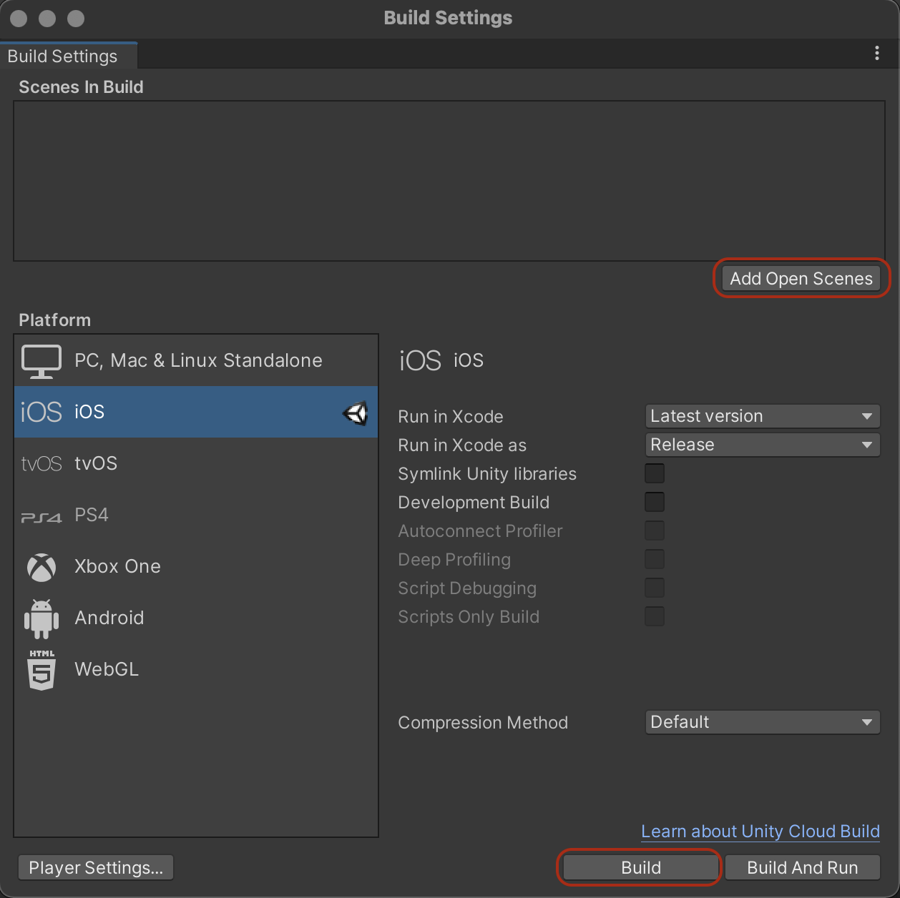

# Build your project

## For **iPhone**

### In Unity

1. Add the current scene to the build: In Unity Editor go to *File* → *Build Settings* and press *Add Open Scene*.
1. Build an Xcode project: Press *Build*. You will be asked to select location for your build. Choose a folder and press *Save*. Now your Xcode project will be created. Note, this isn't the final build or application yet. 

### In Xcode

1. Open the newly created Xcode project with Xcode: For that, open *Finder*, go to your build folder and double click on file with the file extension *.xcodeproj*.
1. Create a developer account in Xcode (if you don’t have one already): Go to *Xcode* → *Preferences* → *Accounts* and click on the *+* icon. Select *Apple ID* and sign in with your Apple ID. Close the popup. Back in Xcode main view select *Unity-iPhone* from the left bar, it will change the middle part of the view. Switch from *General* to the *Signing & Capabilities* tab and check the *Automatically Manage Signing* checkbox. Click on the *Team* dropdown below and select your team.
    * ADD PIC
1. Plugin your mobile device to your computer and press the play icon to build. This will build, install and launch the application on your mobile phone. If you have problems lauching the application on your phone check the section below.

### On mobile device
You might get an error when trying to run the application on your mobile device, a warning about an *Untrusted Enterprise Developer*. To fix this follow [these instructions](https://support.apple.com/en-us/HT204460).

## For **Android**

to be added .. 