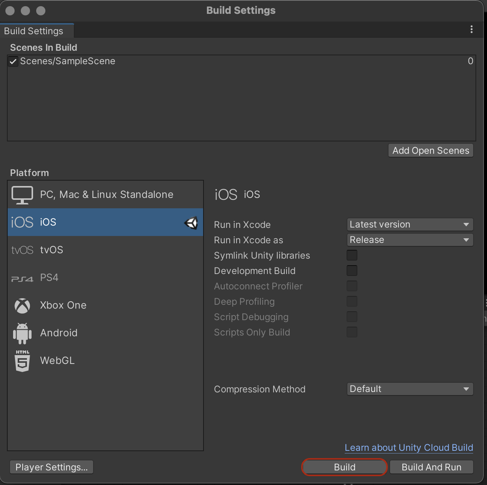

# Build your project

### In Unity

1. Build an Xcode project: In Unity Editor go to *File* → *Build Settings* and press *Build*. You will be asked to select location for your build. Choose a folder and press *Save*.

   

## **iOS** specific

Following the steps above, you created an Xcode project. This isn't the final build or application you can install on your mobile device yet. The application itself will be build with Xcode. To create this final build follow the steps below.

### In Xcode

1. Open your Xcode project with Xcode: For that, open *Finder*, go to your build folder and double click on file with the file extension *.xcodeproj*.
1. Plugin your mobile device to your computer. 
1. Make sure your device is selected as target device: its name should be displayed next to  the *hammer* icon in the top bar.
1. Press the *play* icon to build. This will build, install and launch the application on your mobile phone.

If you have trouble building, this is probably because Xcode forgot your signing method. To fix it, go to Xcode main view, select *Unity-iPhone* from the left bar, switch from *General* to the *Signing & Capabilities* tab and 
- check the *Automatically Manage Signing* checkbox,
- click on the *Team* dropdown below and select your team. 

If you have trouble lauching the application on your phone check the section below.

### On mobile device
You might get an error when trying to run the application on your mobile device, a warning about an *Untrusted Enterprise Developer*. To fix this follow [these instructions](https://support.apple.com/en-us/HT204460).

## For **Android**

to be added .. 