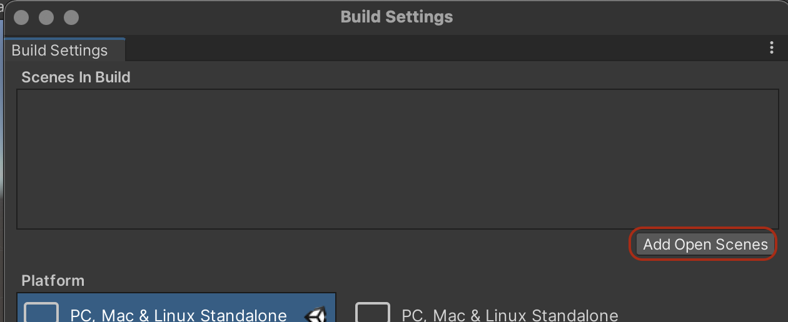
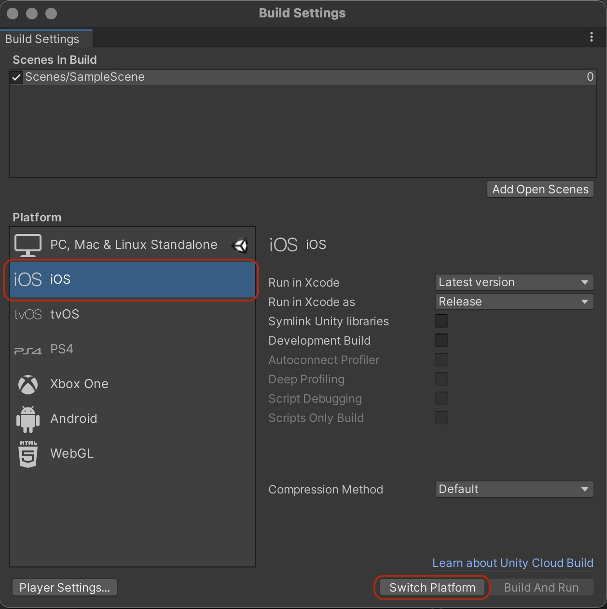
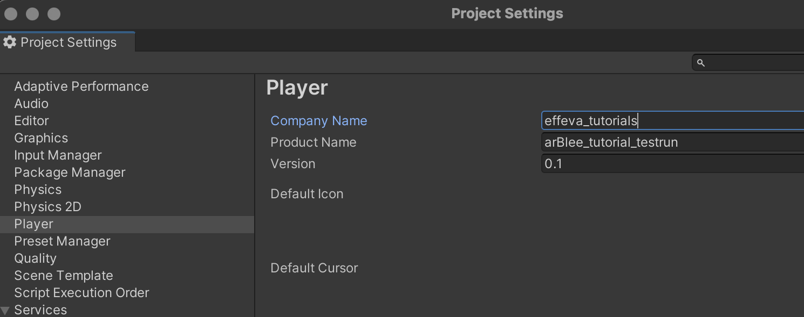

# Project Setup

There are a few things needed to setup a **project for a mobile application** with Unity. The following instructions will guide you through them.

1. Add the current scene to the build: In Unity Editor go to *File* → *Build Settings* and press *Add Open Scene*.  
1. Follow platform specific steps below.

## iOS specific

### In Unity
1. In Unity Editor go to *File* → *Build Settings*, select *iOS* from the platform list below and press *Switch Platform*. Wait for the switch to complete and close the *Build Settings* dialog. From now you will be building for your iPhone. 
1. Go to *Edit* → *Project Settings* → *Player* and enter your *Product Name* and C*ompany Name*. These can be really anything, but try to be somewhat unique. Next select *iOS* tab and *Other Settings*: make sure that *Auto Graphics API* is enabled. Set *Bundle Identifier* to *com.your Company Name.your Product Name* or anything else unique. 
1. Build your project in Unity. For instructions check the first part (Unity part) of [this page](ProjectSetup.md) and come back here to finish the project setup in Xcode.

### In Xcode
1. Open your Xcode project with Xcode: For that, open *Finder*, go to your build folder and double click on file with the file extension *.xcodeproj*.
1. Create a developer account in Xcode (if you don’t have one already): Go to *Xcode* → *Preferences* → *Accounts* and click on the *+* icon. Select *Apple ID* and sign in with your Apple ID. Close the popup. Back in Xcode main view select *Unity-iPhone* from the left bar, it will change the middle part of the view. Switch from *General* to the *Signing & Capabilities* tab and check the *Automatically Manage Signing* checkbox. Click on the *Team* dropdown below and select your team. 

## Android specific
For **Android setup** follow the tutorial on [Unity learn](https://learn.unity.com/tutorial/building-for-mobile).