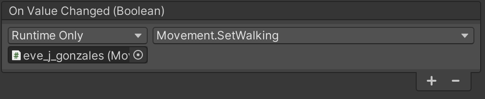
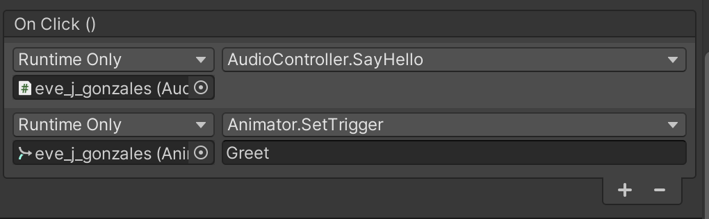
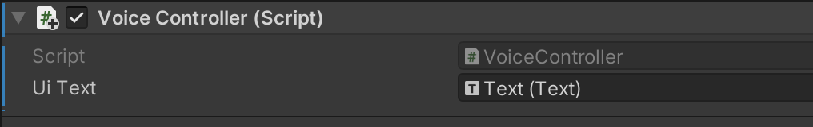
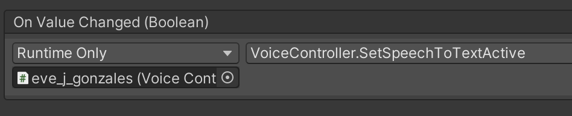

# How to create an AR mobile application with Unity
This project is a collection of tutorials to demonstrate how to create an Augmented Reality app for your mobile phone using Unity. Below you will instructions how to [spawn a character](https://youtu.be/eL_8jF1a4lk) into the environment around you. Which character it will be, is up to you. You will pick one from the [Mixamo](https://www.mixamo.com/) platform. But just so you get an idea, here are a few examples:


<details>
  <summary>Table of Contents</summary>

  * [Environment Setup](#environment-setup---install-required-software)
  * [Project Setup](#project-setup---create-your-first-unity-project)
  * [Build your project](#build-your-first-unity-project)
  * [XR Setup](#get-to-know-xr-and-setup-your-project-for-it)
  * [Create a character with Mixamo](#create-your-character-with-mixamo)
  * [UI elements to control your app](#add-ui-elements-to-your-app)
  * [Sound](#add-sound-to-your-app)
  * [Speech Recognition](#speech-recognition)
  * [Gesture Recognition](#gesture-recognition)

</details>

I assume you are familiar with programming, [IDEs](https://en.wikipedia.org/wiki/Integrated_development_environment) and GitHub. You know the basics and can apply them to new programming languages like C#, Unity development environment and projects in GitHub. No worries, really only basics are needed and for anything you don’t know yet, you can find a tutorial on [YouTube](https://www.youtube.com) or [Unity learn](https://unity.com/learn). 

This tutorial was created using a MacBook and iPhone, but you can also use your Android mobile phone and / or a Windows Desktop or Laptop. However, to create an app for iPhone, you need to install [Xcode](https://developer.apple.com/xcode/) on Apple hardware. Doing it on a Windows machine is possible, but complicated and not part of this tutorial. I am always trying to use the newest Unity version to build the application build in this tutorial. The latest software versions I used can be found [here](Docs/Versions.md).

So, let’s start:

## Environment Setup - Install required software

To setup your computer for this project follow the steps from [this page](Docs/EnvironmentSetup.md) or ensure that you have the latest versions of Unity, Xcode and Visual Studio for Mac (or equivalent for Android or Windows).

## Project Setup - Create your first Unity project

In this tutorial, we will create a mobile application, but if you are new to Unity, you might consider creating a **simple desktop project** first, just to get familiar with the Unity Editor and learn some basics, like for example Unity Editor navigation. [Get started with Unity - Creator Kit: Beginner Code](https://learn.unity.com/tutorial/get-started-with-creator-kit-beginner-code) and [Create with code](https://learn.unity.com/course/create-with-code) are 2 tutorials, which cover creating basic desktop applications.

To setup a mobile project follow the steps from [this page](Docs/ProjectSetup.md).

## Build your first Unity project

To build a mobile application follow the steps from [this page](Docs/Build.md).

Now you can build and run your app on a mobile device, but your application is a bit boring. Let’s start changing that.

## Get to know XR and setup your project for it

XR is an umbrella term encompassing **augmented**, **virtual**, and **mixed reality**. An extensive tutorial on XR can be found [here](https://learn.unity.com/tutorial/what-is-xr).

**Augmented Reality AR** is reality augmented (or enhanced) with virtual items. Unity Editor provides a special module to support AR: AR Foundation. [What is Unity AR Foundation?](Docs/WhatIsUnityARFoundationYouTubeVideo.md) is a very good tutorial about AR in Unity. It also shows how to **setup AR in Unity** and how to **create markers in AR**, which is the first step to be able to place a character of your choice into the environment around you.

I'm strongly relaying on the AR Tutorial, but not following it completely. Therefore, feel free to watch it, it is very helpful, but for the app we are creating, follow the steps described below.

[AR Unity Samples](https://github.com/Unity-Technologies/arfoundation-samples) on GitHub are the best way to learn more about the current Unity AR possibilities. These samples are updated with each Unity version, therefore are always up-to-date.

First, we will **setup AR components** in your project (Note: for **Android** setup follow the instructions on [YouTube](https://www.youtube.com/watch?v=FGh7f-PaGQc) staring around minute 7:40):

1. In Unity Editor go to *Edit* → *Project Settings* → *Player* and:
    1. add a *Camera Usage Description*, something like: “Enable to use AR Foundation”.
    2. Select *XR Plug-in Management* from the left bar and press *Install XR Plug-in Management*. After the installation is completed check the *ARKit* checkbox to install the iOS AR support. Then select *ARKit* from the left bar and set *Requirement* to *Optional*.
2. In Unity Editor go to *Window* → *Package Manager*. In *Package Manager* window open *Packages: In Project* dropdown and select *Unity Registry*. Search for *AR Foundation*, select it and press *Install*. Close the *Package Manager* window.
3. Now you can add AR Foundation components to your project: Right click in [*Hierarchy* window](https://docs.unity3d.com/2020.2/Documentation/Manual/UsingTheEditor.html) and select *XR* → *AR Session Origin*. You can find more details about this component on [Unity docs](https://docs.unity3d.com/Packages/com.unity.xr.arfoundation@1.0-preview.8/api/UnityEngine.XR.ARFoundation.ARSessionOrigin.html) web pages. This component has its own camera, therefore go ahead and delete the existing *Main Camera* from the *Hierarchy* window. Select the *AR Camera* under the *AR Session Origin*, go to the *Inspector* window and change its *Tag* from *Untagged* to *MainCamera*. Next, right click in *Hierarchy* window and select *XR* → *AR Session*.

Now, we will add **plane detection**:

1. First add a plane manager to your session origin: Select *AR Session Origin* in *Hierarchy* window, go to the *Inspector* window, press *Add Component*, search for *AR Plane Manager* and add it to the *AR Session Origin*.
2. Create a plane prefab: Right click in *Hierarchy* window and select *XR* → *AR Default Plane*. Create a *Prefab* folder in your project: Select *Assets* folder in *Project* window, right click, select *Create* → *Folder* and rename it to *Prefab*. Move the *AR Default Plane* from the *Hierarchy* window to the newly created *Prefab* folder. Delete the *AR Default Plane* in the *Hierarchy* window.
3. Assign the plane prefab to the plane manager: Select the *AR Session Origin* in *Hierarchy* window, go to the *Inspector* window, open the *Plane Prefab* dropdown in the *AR Plane Manager*, select the *Assets* tab and select the *AR Default Plane* prefab.

[Build](Docs/Build.md) your application again and test if you can see the planes around you. You should be able to see planes being detected on the ground, walls, tables etc.

ADD PIC

After making sure that this part is working, remove the *AR Default Plane* prefab from the *AR Plane Manager*: You can do that in the *Inspector* window. Click on the *Plane Prefab* dropdown and select *None*.

Next, let’s **add a marker** to your app. It will mark the spot on which you will later place objects. An asset for the marker is in this project. 

1. Add the marker asset to your Unity project: create a new folder in the *Project* window and name it *Textures*. Now drag and drop the indicator asset into this folder. Select the newly added asset, enable *Alpha is Transparency* in the *Inspector* window and press *Apply*. For more information about textures in Unity check the [Textures](https://docs.unity3d.com/2020.2/Documentation/Manual/Textures.html) documentation in Unity Manual.
2. Create a material for the new asset: Create a new folder in the *Project* window and name it *Materials*. Select it, right click and select *Create* → [*Material*](https://docs.unity3d.com/2020.2/Documentation/Manual/class-Material.html) and rename it to *Indicator_mat*. While the new material is still selected, go to the *Inspector* window, change the *Shader* to *Unlit* → *Transparent* and set the *Texture* to marker texture previously added.
3. Create an object for the marker: 
    1. Right click in *Hierarchy* window, select *Create Empty* to create an empty game object and rename it to *PlacementIndicator*. Go to the *Inspector* window and set the *Position* to (0,0,0). 
    2. Go back to the *Project* window and create a plane object under *PlacementIndicator*: Right click and select *3D Object* → *Plane*. While the *Plane* is selected, go to the *Inspector* window and
        1. set the *Scale* to (0.02, 0.02, 0.02), 
        2. set *Cast Shadows* to *off* and 
        3. disable *Receive Shadows*. 
        4. Also remove the *Mesh Collider* component. The plane doesn’t need it. Do delete a component press the 3 dots icon in the upper right corner of the component you wish to remove and select *Remove Component*. 
    4. Now, drag the *PlacementIndicator* material on the *Plane* object in the *Scene* view in the center of the Unity Editor.

At this point you can [build](Docs/Build.md) your application again and check if you can see the indicator. It will be always at the same position, therefore next, we will add logic, so the indicator can follow your movement and be used it as a **placement indicator**. For this you will need to add some **C# code**.

1. Create a new C# script: First create a *Scripts* folder under *Assets* in the *Hierarchy* window. Then right click on the folder, select *Create* → *C# Script* and rename it directly to *PlacementIndicator*.
2. Attach the C# script to the *PlacementIndicator* game object: To do that, select the *PlacementIndicator* game object in the *Hierarchy* window, go to the *Inspector* window, press *Add Component*, search for the *Placement Indicator* C# script and select it.
3. Add logic to the *PlacementIndicator* C# script: Double click on the *PlacementIndicator* script in the *Hierarchy* window to open it in *Visual Studio*. Replace the existing code with:
``` C#
using System.Collections.Generic;
using UnityEngine;
using UnityEngine.XR.ARFoundation;
using UnityEngine.XR.ARSubsystems;

public class PlacementIndicator : MonoBehaviour {
    public GameObject IndicatorIcon;

    private Pose placementPose;
    private bool placementPoseIsValid = false;

    // Manager & Controller
    private ARRaycastManager aRRaycastManager;
    private ARPlaneManager aRPlaneManager;

    // Start is called before the first frame update
    void Start() {
        // get components
        aRRaycastManager = FindObjectOfType<ARRaycastManager>();
        aRPlaneManager = FindObjectOfType<ARPlaneManager>();
        CheckAllObjects();

        // hide indicator
        IndicatorIcon.SetActive(false);
    }

    void CheckAllObjects() {
        if (aRRaycastManager == null) Debug.LogError("aRRaycastManager is NULL");
        if (aRPlaneManager == null) Debug.LogError("aRPlaneManager is NULL");
        if (IndicatorIcon == null) Debug.LogError("Indicator is NULL");
    }

    // Update is called once per frame
    void Update() {
        UpdateGamePlacementPose();
        UpdateGamePlacementIndicator();
    }

    void UpdateGamePlacementPose() {
        if (aRRaycastManager != null && Camera.current != null) {
            // shoot a raycast from the center of the screen
            Vector3 screenCenter = Camera.current.ViewportToScreenPoint(new Vector3(0.5f, 0.5f));
            List<ARRaycastHit> hits = new List<ARRaycastHit>();
            aRRaycastManager.Raycast(screenCenter, hits, TrackableType.Planes);

            placementPoseIsValid = false;

            // if we hit a AR plane, update the position and rotation 
            foreach (ARRaycastHit hit in hits) {
                ARPlane plane = aRPlaneManager.GetPlane(hit.trackableId);
                if (plane != null) {
                    placementPoseIsValid = true;
                    placementPose = hit.pose;
                    break;
                }
            }
        }
    }

    void UpdateGamePlacementIndicator()
    {
        if (placementPoseIsValid) {
            IndicatorIcon.SetActive(true);
            transform.SetPositionAndRotation(placementPose.position, placementPose.rotation);
        } else {
            IndicatorIcon.SetActive(false);
        }
    }
}
```
To learn more about the Unity scripting framework and the provided components check the Unity [Manual](https://docs.unity3d.com/Manual/index.html) and [Scripting API](https://docs.unity3d.com/ScriptReference/index.html).

4. Don’t forget to save your changes to the C# script file.
5. Connect the *Plane* game object to the script: select the *PlacementIndicator* game object in the *Project* window, go to *Inspector* window, open the *Indicator Icon* dropdown and select *Plane*.
6. Add *AR Raycast Manager* to the *AR Session Origin*: Select *AR Session Origin* in the *Project* window, go to the *Inspector* window, click *Add Component*, search for *AR Raycast Manager* and select it.

[Build](Docs/Build.md) again and see how your placement indicator behaves now. It should indicate plane places around you and disappear when no plane can be detected. You will notice that when you move around, the indicator is **rotating** in an unexpected way. Let’s **fix** that.

1. Add logic to the *PlacementIndicator* C# script: double click on the *PlacementIndicator* script in the *Hierarchy* window to open it in *Visual Studio*. Replace the *UpdateGamePlacementPose* method with the following code:
``` C#
void UpdateGamePlacementPose() {
    if (aRRaycastManager != null && Camera.current != null) {
        // shoot a raycast from the center of the screen
        Vector3 screenCenter = Camera.current.ViewportToScreenPoint(new Vector3(0.5f, 0.5f));
        List<ARRaycastHit> hits = new List<ARRaycastHit>();
        aRRaycastManager.Raycast(screenCenter, hits, TrackableType.Planes);

        placementPoseIsValid = false;

        // if we hit a AR plane, update the position and rotation 
        foreach (ARRaycastHit hit in hits) {
            ARPlane plane = aRPlaneManager.GetPlane(hit.trackableId);
            if (plane != null) {
                placementPoseIsValid = true;
                placementPose = hit.pose;

                // rotate in view direction
                Vector3 cameraForward = Camera.current.transform.forward * -1.0f;
                Vector3 cameraBearing = new Vector3(cameraForward.x, 0.0f, cameraForward.z).normalized;
                placementPose.rotation = Quaternion.LookRotation(cameraBearing);

                break;
            }
        }
    }
}
```
2. Don’t forget to save your changes to the C# script file.

Now [build](Docs/Build.md) again and check how the placement indicator is behaving. It should smoothly rotate with you while you are moving around.

Next we will add logic to **spawn an object at the location of the indicator** when you touch the screen.

1. Create a new game object to be placed at the indicator location: Right click on the *Hierarchy* window, press *Create Empty*, rename the object to *CubeObject* and set its *Position* to (0,0,0). Now, select the newly created object, right click, press *3D Object* → *Cube*. Set the cube's *Position* to (0,0.05,0) and *Scale* to (0.1, 0.1, 0.1). Delete it’s *Box Collider*, it’s not needed. 
2. Add logic to spawn the *Cube* to the C# script: double click on the *PlacementIndicator* script in the *Hierarchy* window to open it in *Visual Studio*. Replace the existing code with: 
``` C#
using System.Collections.Generic;
using UnityEngine;
using UnityEngine.XR.ARFoundation;
using UnityEngine.XR.ARSubsystems;

public class PlacementIndicator : MonoBehaviour {
    public GameObject IndicatorIcon;
    public GameObject ObjectToPlace;
    
    private Pose placementPose;
    private bool placementPoseIsValid = false;

    // Manager & Controller
    private ARRaycastManager aRRaycastManager;
    private ARPlaneManager aRPlaneManager;

    // Start is called before the first frame update
    void Start() {
        // get components
        aRRaycastManager = FindObjectOfType<ARRaycastManager>();
        aRPlaneManager = FindObjectOfType<ARPlaneManager>();
        CheckAllObjects();

        // hide indicator and object to place
        IndicatorIcon.SetActive(false);
        ObjectToPlace.SetActive(false);
    }

    void CheckAllObjects() {
        if (aRRaycastManager == null) Debug.LogError("aRRaycastManager is NULL");
        if (aRPlaneManager == null) Debug.LogError("aRPlaneManager is NULL");
        if (IndicatorIcon == null) Debug.LogError("Indicator is NULL");
        if (ObjectToPlace == null) Debug.LogError("ObjectToPlace is NULL");
    }

    // Update is called once per frame
    void Update() {
        UpdateGamePlacementPose();
        UpdateGamePlacementIndicator();

        if (placementPoseIsValid && Input.touchCount > 0 && Input.GetTouch(0).phase == TouchPhase.Began) {
            PlaceObject();
        }
    }

    void UpdateGamePlacementPose() {
        if (aRRaycastManager != null && Camera.current != null) {
            // shoot a raycast from the center of the screen
            Vector3 screenCenter = Camera.current.ViewportToScreenPoint(new Vector3(0.5f, 0.5f));
            List<ARRaycastHit> hits = new List<ARRaycastHit>();
            aRRaycastManager.Raycast(screenCenter, hits, TrackableType.Planes);

            placementPoseIsValid = false;

            // if we hit a AR plane, update the position and rotation 
            foreach (ARRaycastHit hit in hits) {
                ARPlane plane = aRPlaneManager.GetPlane(hit.trackableId);
                if (plane != null) {
                    placementPoseIsValid = true;
                    placementPose = hit.pose;

                    // rotate in view direction
                    Vector3 cameraForward = Camera.current.transform.forward * -1.0f;
                    Vector3 cameraBearing = new Vector3(cameraForward.x, 0.0f, cameraForward.z).normalized;
                    placementPose.rotation = Quaternion.LookRotation(cameraBearing);

                    break;
                }
            }
        }
    }

    void UpdateGamePlacementIndicator() {
        if (placementPoseIsValid) {
            IndicatorIcon.SetActive(true);
            transform.SetPositionAndRotation(placementPose.position, placementPose.rotation);
        } else 
            IndicatorIcon.SetActive(false);
        }
    }

    void PlaceObject() {
        ObjectToPlace.transform.SetPositionAndRotation(placementPose.position, placementPose.rotation);
        ObjectToPlace.SetActive(true);
    }
}
```
3. Don’t forget to save your changes to the C# script file.
4. Connect the CubeObject object with the script: select the *PlacementIndicator* game object in the *Project* window, go to *Inspector* window, open the *Object To Place* dropdown and select *CubeObject*.

[Build](Docs/Build.md) again and test your changes. Once the placement indicator is visible, touch the screen. Every time you touch the screen the cube will appear at the position of the indicator.

## Create your character with Mixamo

In this step, we will replace the cube with a character. Creating a character by yourself and ensuring the it moves according to the physical system is quite complicated. We will therefore use a ready made character from [Mixamo](https://www.mixamo.com/). Mixamo provides animated 3D characters for games and films. You only need to create an account, login and then you can choose from around 120 characters and more than 2000 animations.

To import a character from Mixamo to Unity follow the steps below:

1. Go to the [Mixamo](https://www.mixamo.com/) web page and login.
2. Download a character from Mixamo: Select the *Character* tab, choose one of the characters and press *Download*. In the *Download Settings* dialog open the *Format* dropdown, select *FBX for Unity* and press the *Download* button. You can download the character to the default download folder.
3. Import the character to Unity: Go to *Unity Editor* and create a *Characters* folder under *Assets* in the *Project* window. Drag and drop the downloaded character to the newly created folder. Now drag and drop the character from the *Characters* folder in the *Project* window to the *Hierarchy* window. The character will appear in the *Scene* view. If you zoom in on the character in the *Scene* view, you will notice that the textures are not displayed. Let’s fix that: Select your character in the *Project* window, go to the *Inspector* window, select *Materials*, click on *Extract Textures…* and select the *Textures* folder. While extracting Unity will warn you about normal map and ask you, if it should fix it: press *Fix now*. If you check your character in the *Scene* view again, you will notice that the textures are displayed correctly.
4. Your character might be a bit dark, the *Directional Light* (the sun) might be pointing in the wrong direction. To change this: Select *Directional Light* in the *Hierarchy* window, go to the *Inspector* window and change the *Y*-value of the *Rotation* to adapt the light direction.

You can [build](Docs/Build.md) your application again, to double check that you can see the character you just added. Once you start the app on your mobile, the character will be added at Position (0,0,0), so basically at your position. You will have to move and point your mobile towards the position your were standing, to actually see your character.

The character is standing at an odd place, has an odd pose and is also quite big. In the next steps we will fix all that. Let’s start by replacing the cube and instead **spawn** the **character at** the **indicator position**:

1. Attach the character to the *PlacementIndicator* script: select the *PlacementIndicator* game object in the *Project* window, go to *Inspector* window, open the *Object To Place* dropdown and select your character. You can also delete the *CubeObject* now. We will not need it anymore.
2. Change the size of the character: Select your character in the *Characters* folder in the *Project* window, go to the *Inspector* window, select *Model*, change the value for *Scale Factor* to 0.4 and press *Apply*.

You can [build](Docs/Build.md) your application again, to check your changes. Instead of the cube, your character should now appear at the position of the indicator every time you touch the screen.

Next we will **add** an idle **animation to** the **character** to make it stand more natural.

1. Download an animation from Mixamo: Go back to the [Mixamo](https://www.mixamo.com/) web page. While your character is still selected, select the *Animations* tab, enter *Idle* in the search text field, select one of the idle animations and press *Download*. In the *Download Settings* dialog make sure that:
    1. *Format* is set to *FBX for Unity* and 
    2. *Skin* to *Without Skin*.
2. Import the animation to Unity:
    1. Drag and drop the downloaded animation to the *Characters* folder in *Project* window in the *Unity Editor*. 
    2. Select *Assets*, right click and select *Create* → *Animation Controller*. Rename the animation controller to *CharacterAnimationController*. 
    3. Select your character in the *Hierarchy* window, go to the *Inspector* window and add an *Animator* component. Open the *Controller* dropdown in the *Animator* component and select the *CharacterAnimationController*. 
    4. Next, double click on the *CharacterAnimationController* in the *Project* window. It will open the *Animator* window for this controller. Right click on the [gridded *Base Layer* area](https://docs.unity3d.com/2020.2/Documentation/Manual/AnimatorWindow.html), create a new state, using the *Empty* state. Rename this state to *Idle*. Open the dropdown for the *Motion* field in the *Inspector* window and select *Idle*. 
    5. To repeat this animation endlessly, select the animation in the *Project* window, go to *Inspector* window, enable *Loop Time* and press *Apply*.
    6. Select the animation for your character in the *Characters* folder in the *Project* window, then go to the *Inspector* window, select *Model*, change the value for *Scale Factor* to 0.4 and press *Apply*.

[Build](Docs/Build.md) your application again and check how your character behaves.

Now, we will add a **second animation**. This time, it will be an animation for walking. We will adapt the *PlacementIndicator* script so, that after the character is visible, the marker will disappear and a touch on the screen will make the character walk.

1. Download a walk animation from Mixamo: 
    1. Go back to the [Mixamo](https://www.mixamo.com/) web page. 
    1. While your character is still selected, select the *Animations* tab, search for *walk*, select one of the walk animations. 
    1. Before pressing *Download* make sure the animation is *In Place*. There is a *In Place* checkbox under the *Download* button. Set it. 
    1. Then press *Download*. In the *Download Settings* dialog set:
        1. *Format* to *FBX for Unity* and 
        1. *Skin* to *Without Skin*.
1. Import the walk animation to Unity:
    1. Drag and drop the downloaded animation to the *Characters* folder in *Project* window in the *Unity Editor*. 
    1. Next, double click on the *CharacterAnimationController* in the *Project* window to open the *Animator* window. Right click on the squared *Base Layer* area, create a new state, using the *Empty* state. Rename this state to *Walk*. Open the dropdown for the *Motion* field in the *Inspector* window and select the downloaded walk animation.
    1. Select the animation for your character in the *Characters* folder in the *Project* window, then go to the *Inspector* window, select *Model*, change the value for *Scale Factor* to 0.4 and press *Apply*.
1. Create a transition between animations: 
    1. Go to the *Animator* window, right click on the *Idle* animation in the squared *Base Layer* area, select *Make Transition* and connect the transition (visible as an arrow) to the *Walk* animation in the squared *Base Layer* area. Now create another transition in the opposite direction, right click on the *Walk* animation in the squared *Base Layer* area, select *Make Transition* and connect the transition to the *Idle* animation in the squared *Base Layer* area. You should end up with a animation diagram similar to this: 
    1. Select one of the newly created transitions and disable the *Has Exit Time* option in the *Inspector* window. Do this for both transitions.
    1. In the *Animator* window, on the left are 2 tabs: *Layers* and *Parameters*. Select the *Parameters* tab, click on the *+* icon next to the text box and select *Bool*. Rename it to *IsWalking*. This is a boolean Animator parameter which we will use to enable and disable the *Walk* animation. 
    1. Select the transition from *Idle* to *Walk* in the in the squared *Base Layer* area, go to the Inspector window, scroll down to the *Conditions* section and select the + icon. It should automatically add the *IsWalking* parameter with value *true* to the *Conditions*: 
    1. Now, do the same for the transition between *Walk* and *Idle*, but set the condition to *false*.
1. Create a new C# script to control the switch between the *Idle* and *Walk* animation.
    1. First go to the *Scripts* folder under *Assets* in the *Hierarchy* window. Then right click on the folder, select *Create* → *C# Script* and rename it directly to *Movement*.
    1. Double click on the *Movement* script in the *Hierarchy* window to open it in *Visual Studio*. Replace the existing code with and save it: 
    ``` C#
    using UnityEngine;

    public class Movement : MonoBehaviour {
        Animator _animator;

        void Start() {
            _animator = GetComponent<Animator>();

            if (_animator == null) Debug.LogError("_animator is NULL");
        }

        void Update() {
            if (Input.touchCount > 0 && Input.GetTouch(0).phase == TouchPhase.Began) {
                _animator.SetBool("IsWalking", !_animator.GetBool("IsWalking"));
            }
        }
    }
    ```

5. Add the *Movement* script to the character game object: Select your character in the *Hierarchy* window, go to the *Inspector* window, press *Add Component*, search for the *Movement* script and select it. Open the *Animator* dropdown and select your character. Now, your script is connected with the *Animator* and can access the Animation parameter we specified above.
6. There is still one thing we need to do: Change the behaviour in the *PlacementIndicator* script. You remember, it was placing the marker whenever you touch the screen. But now, we want that once the character is visible, the marker disappears, and the touch to control the character animation instead. The last part is already handled by the *Movement* script. Let's take care of the *PlacementIndicator* script. 
    1.  Double click on the *PlacementIndicator* script in the *Hierarchy* window to open it in *Visual Studio*.
    2. Add the following line at the end of the *PlaceObject* method to make the marker invisible after the object was placed:

    ``` C#
    IndicatorIcon.SetActive(false);
    ```
    3. Add an *if-statement* to the *Update* method to prevent from running when not needed:
    ```C#
    void Update() {
        if (!ObjectToPlace.activeInHierarchy) {
            UpdateGamePlacementPose();
            UpdateGamePlacementIndicator();

            if (placementPoseIsValid && Input.touchCount > 0 &&
                Input.GetTouch(0).phase == TouchPhase.Began) {
                PlaceObject();
            }
        }
    }
    ```
    4. Save the script.

Try your application again. You will notice that your character is walking, but walking in place. No wonder, this is how we downloaded it. As a next step, we will adapt the *Movement* script to **make the character move when the *Walk* animation** is running.

1. One way to control the character movement is by using the *CharacterController* component. Therefore add *CharacterController* component to your character in the *hierarchy* window.
2. Now update the *Movement* script to use the *CharacterController* to make move your character forward:
```C#
using UnityEngine;

public class Movement : MonoBehaviour {
    float _speed = 0.5f;

    Animator _animator;
    CharacterController _controller;

    void Start() {
        _animator = GetComponent<Animator>();
        _controller = GetComponent<CharacterController>();

        if (_animator == null) Debug.LogError("_animator is NULL");
        if (_controller == null) Debug.LogError("_controller is NULL");
    }

    void Update() {
        if (Input.touchCount > 0 && Input.GetTouch(0).phase == TouchPhase.Began) {
            _animator.SetBool("IsWalking", !_animator.GetBool("IsWalking"));
        }

        if (_animator.GetBool("IsWalking")) MoveForward();
    }

    void MoveForward() {
        Vector3 direction = new Vector3(0, 0, 1);
        Vector3 velocity = direction * _speed;

        velocity = transform.transform.TransformDirection(velocity);

        _controller.Move(velocity * Time.deltaTime);
    }
}
```
3. Save the script.
4. Run your application and test the speed of your character. Adjust the speed value in the *Movement* script to align forward movement of your character with the *Walk* animation and make it feel natural.

[](http://www.youtube.com/watch?v=eL_8jF1a4lk)

## Add UI elements to your app
It will get difficult to control your app with only one tap gesture. There several ways to fix that. One way is to **add UI elements** like Buttons or Slider to your app. In this section we will **add a Slider** to control from which direction the light (sun) is shinning on your character.

1. Create a [*Canvas*](https://docs.unity3d.com/Packages/com.unity.ugui@1.0/manual/UICanvas.html) component for the UI components: To be able to add UI elements to your application, first you need to create a *Canvas* component which will contain all your UI elements. Go to the *Hierarchy* window, right click on it and select *UI* -> *Canvas*.
1. Create a [*Slider*](https://docs.unity3d.com/Packages/com.unity.ugui@1.0/manual/UIInteractionComponents.html#slider) component: 
    1. Go to the *Hierarchy* window, select the *Canvas* component, right click on it and select *UI* -> *Slider*.
    1. Double click on the *Canvas* component to display and center it in the *Scene view*. Then select the *Slider* component to the desired position. To better understand, where the *Slider* will appear on your mobile phone, change the layout of the Unity Editor and place the [*Game view*](https://docs.unity3d.com/2020.2/Documentation/Manual/GameView.html) next to the *Scene view*. The *Game view* can be adapted to display your preferred *Aspect*. 
    1. To improve the usability of the *Slider*, set the *Y*-Value of the *Scale* in the *Inspector* window to: a higher value. Try for example 4. 
1. Disable the *Movement* script for now: go to the *Hierarchy* window, select your character, go to the Inspector window, scroll down to the Movement script and click the checkbox left from the script's name to disable the script.
1. Create a new script to change the light direction: go to the *Hierarchy* window, select the *Directional Light* component, go to the *Inspector* window, scroll down, press *Add Component*, enter *LightController*, select *New Script* and press *Create and Add*.
1. Connect the new *LightController* script to the *Slider*: go to the *Hierarchy* window, select the *Slider* component, go to the *Inspector* widow, scroll down to the *On Value Changed (Single)* section, press the *+* icon. At the moment no object is selected, this is indicated with *None (Object)*. Open the dropdown to select an object, switch to *Scene* tab and select the *Directional Light* component. Then select a function to be called: open the dropdown and select *LightController* and *SetShadowDirection*. 

Build your app again and test your changes. 

Right now your character cannot walk. To enable walking again, we will **add another UI element**: a **Toggle**.
1. Create a [*Toggle*](https://docs.unity3d.com/Packages/com.unity.ugui@1.0/manual/UIInteractionComponents.html#toggle) component: Go to the *Hierarchy* window, select the *Canvas* component, right click on it and select *UI* -> *Toggle*. Position the Toggle in your Canvas in similar way as you positioned the *Slider* component. 
1. Enable the *Movement* script again and edit it:
    1. Remove the following *if-statement* from the *Update* method:
    ```C#
    if (Input.touchCount > 0 && Input.GetTouch(0).phase == TouchPhase.Began) {
        _animator.SetBool("IsWalking", !_animator.GetBool("IsWalking"));
    }
    ```  
    2. and add a new method:
    ```C#
    public void SetWalking(bool isWalking) {
        if (_animator != null) _animator.SetBool("IsWalking", isWalking);
    }
    ```
1. Connect the new *SetWalking* method from the *Movement* script to the *Toggle*: Go to the *Hierarchy* window, select the *Toggle* component, go to the *Inspector* widow, scroll down to the *On Value Changed (Boolean)* section, press the *+* icon. Open the dropdown to select an object, switch to *Scene* tab and select your character. Then select a function to be called: open the dropdown and select *Movement* and *SetWalking*. 
   

Build your app again and test your changes. 

Both UI elements, Slider and Toggle, are visible on the screen although the character is not placed yet. But this elements are only used for controlling the character. They should only appear when the character is visible. We will add a **UI Manager**, which will handle the **visibility of the UI elements**.

1. Create a *UIManager* game object: Go to the *Hierarchy* window, right click on the *Canvas* component and press *Create Empty* to create an empty game object. Rename the new object to *UIManager*.
1. Add a script to the *UIManager*: Select the *UIManager* in the *Hierarchy* window and go to the *Inspector* window. Press *Add Component*, write *UIManager*, select *New Script* and *Create and Add*. Double click on the newly created script in the *Project* window to open it in the *Visual Studio*. Replace the exist code with:
```C#
using UnityEngine;

public class UIManager : MonoBehaviour {
    [SerializeField]
    GameObject slider;
    [SerializeField]
    GameObject toggle;

    public void SetSliderActive(bool value) {
        slider.SetActive(value);
    }

    public void SetToggleActive(bool value) {
        toggle.SetActive(value);
    }
}
``` 
3. Connect the UI elements with the *UIManager*: Go to the *Hierarchy* window, select the *UIManager*, go to the *Inspector* window. In the *UI Manager (Script)* section are 2 fields: *Slider* and *Toggle*. Set both to the respective game objects. 
4. Create a new script to control the visibilty of the UI elements via the *UIManager*: Select your character in the *Hierarchy* window and go to the *Inspector* window. Press *Add Component*, write *VisibilityController*, select *New Script* and *Create and Add*. Double click on the newly created script in the *Project* window to open it in the *Visual Studio*. Replace the exist code with:
```C#
using UnityEngine;

public class VisibilityController : MonoBehaviour {
    [SerializeField]
    UIManager uiManager;

    private void OnEnable() {
        uiManager.SetSliderActive(true);
        uiManager.SetToggleActive(true);
    }

    private void OnDisable() {
        uiManager.SetSliderActive(false);
        uiManager.SetToggleActive(false);
    }
}
```
5. Connect the *UIManager* with the newly create *VisibilityController* script: Go to the *Hierarchy* window, select your character, go to the *Inspector* window. In the *Visibility Controller (Script)* section is a field for the *UI Manager*. Select the *UIManager* via the dropdown. 

Build your app again and test your changes.

## Add Sound to your app
In this section we will **add sound** to your application. We will add another animation to your character, a greeting animation, and make the character say *Hello*. For that we will add another UI element, a Button. Everytime the button is pressed the **character will switch to the greeting animation and say Hello**.

Let's start:

1. Get an *Audio file*: You can create one yourself, for example with the sound recorder from your phone, or use any other existing sound file you wish. Since, we are going to use it together with the *Greeting* animation, choose a sound which will fit in this context. Here is a list of [Audio file formats Unity supports](https://docs.unity3d.com/2020.2/Documentation/Manual/AudioFiles.html).
1. Create an *Audio* folder in the *Project* window and add the *Audio file* to it. 
1. Add an *Audio Source* component to your character. 
1. Connect the *Audio Source* component with the *Audio file*: Go to the *Hierarchy* window, select your character, go to the *Inspector* window. Scroll down to the *Audio Source* component. Open the *AudioClip* dropdown and select your *Audio file*.
1. Disable *Play on Awake* option in the *Audio Source* component.
1. Create a new script *AudioController* and add it to your character.
1. Open the new script in *Visual Studio* and replace the exist code with:
```C#
using UnityEngine;

public class AudioController : MonoBehaviour {
    AudioSource helloAudioSource;

    void Start() {
        helloAudioSource = GetComponent<AudioSource>();
        if (helloAudioSource == null) Debug.LogError("helloAudioSource is NULL");
    }

    public void SayHello() {
        if (!helloAudioSource.isPlaying) helloAudioSource.Play();
    }
}
```
8. Save the script.
1. Add a *Button* to the *Canvas* in the *Hierarchy* window, position the *Button* in the *Scene* view and change the *Label* text to *Hello*.
1. Connect the *Button* to the *AudioController* script: Select the *Button* in the *Hierarchy* window, go to the *Inspector* window, scroll down to the *OnClick* section and press the *+* icon. Open the dropdown to select an object, switch to *Scene* tab and select your character. Then select a function to be called: open the dropdown and select *AudioController* and *SayHello*. 

Build your app again and test your changes. Now everytime you press the *Hello* Button, your character will say *Hello* to you. But the animation doesn't match. We will **add a new Greeting animation** and connect the sound to it. This time, we will use a **Trigger Transition** to trigger the animation.

1. [Download and import](#create-your-character-with-mixamo) a greeting animation from [Mixamo](https://www.mixamo.com/)
1. Double click on the *CharacterAnimationController* in the *Project* window to open the *Animator* window. Right click on the squared *Base Layer* area, create a new state, using the *Empty* state. Rename this state to *Greet*. Open the dropdown for the *Motion* field in the *Inspector* window and select the downloaded greeting animation.
1. Adapt the animation scale to align with the character scale: Select the animation for your character in the *Characters* folder in the *Project* window, then go to the *Inspector* window, select *Model*, change the value for *Scale Factor* to *0.4* and press *Apply*.
1. Add an Animation trigger for Greeting: In the *Animator* window, on the left are 2 tabs: *Layers* and *Parameters*. Select the *Parameters* tab, click on the *+* icon next to the text box and select *Trigger*. Rename it to *Greet*. This is an Animator Trigger, which we will use to trigger the *Greeting* animation.
1. Add transitions: Go to the *Animator* window, right click on the *Idle* animation in the squared *Base Layer* area, select *Make Transition* and connect the transition (visible as an arrow) to the *Greet* animation in the squared *Base Layer* area. Now create another transition in the opposite direction, right click on the *Greet* animation in the squared *Base Layer* area, select *Make Transition* and connect the transition to the *Idle* animation in the squared *Base Layer* area.
1. Setup transitions: Select the transition from *Idle* to *Greet* in the in the squared *Base Layer* area, go to the Inspector window, 
    - Disable the *Has Exit Time* option.
    - scroll down to the *Conditions* section and select the + icon. It should automatically add the *IsWalking* parameter with value *true* to the *Conditions*. Change the *IsWalking* parameter to *Greet*.
1. Call the *Trigger* from the *Button* *onClick* section: Select the *Button* in the *Hierarchy* window, go to the *Inspector* window, scroll down to the *On Click ()* section and press the *+* icon. Open the dropdown to select an object, switch to *Scene* tab and select your character. Then select a function to be called: open the dropdown and select *Animator* and *SetTrigger (string)*. In the text field enter *Greet*. 

Build your app again and test your changes.

## Speech Recognition
It would be nice, if we could better interact with the character, for example talk. We could make it say Hello, when somebody says Hello to it. To be able to do it, we need Speech Recognition. There are different ways to implement Speech Recognition with Unity. I decided to use [PingAK9 Plugin](https://github.com/PingAK9/Speech-And-Text-Unity-iOS-Android). It can be used with iOS and supports the newest Unity releases. It also uses the iOS internal Speech Recognition Engine. These are all big pros.

Let's start:

1. Download this [zip file](https://github.com/PingAK9/Speech-And-Text-Unity-iOS-Android/archive/master.zip) from the *[PingAK9/Speech-And-Text-Unity-iOS-Android](https://github.com/PingAK9/Speech-And-Text-Unity-iOS-Android)* repository on GitHub and unzip it.
1. Create a new *PingAK9* folder in *Assets* folder in the *Project* window.
1. Copy the following from the downloaded files to the new PingAK9 folder:
    - Editor folder (keep the folder and the folder name)
        - BuildPostProcessor.cs
    - iOS folder
        - SpeechRecorderViewCotroller.h
        - SpeechRecorderViewCotroller.mm
        - SpeechUtteranceViewCotroller.h
        - SpeechUtteranceViewCotroller.mm
    - SpeechToText.cs
    - SpeechToText.prefab
1. Add the *SpeechToText.prefab* to the scene in your *Hierarchy* window.
1. Create UI elements to control the speech recongnition:
    - create a *Toggle* in your Canvas Game Object. Rename it to *ToggleSpeech* and change the text to *Speech*.
    - create a *Text* in your Canvas Game Object. Change the text to ... .
1. Add a new C# script to your character in the *Hierarchy* window. Call it *VoiceController*.
1. Open the script with *Visual Studio* and replace the source code with:

```C#
using TextSpeech;
using UnityEngine;
using UnityEngine.UI;

public class VoiceController : MonoBehaviour {

    const string LANG_CODE = "en-US";
    [SerializeField]
    Text uiText;

    void Start() {
        Setup(LANG_CODE);
        SpeechToText.instance.onResultCallback = OnFinalSpeechResult;
    }

    public void SetSpeechToTextActive(bool active) {
        if (active) StartListening();
        else StopListening();
    }

    void StartListening() {
        SpeechToText.instance.StartRecording();
    }

    void StopListening() {
        SpeechToText.instance.StopRecording();
    }

    void OnFinalSpeechResult(string result) {
        uiText.text = result;
        Debug.Log("OnFinalSpeechResult result: " + result);
    }

    void Setup(string languageCode) {
        SpeechToText.instance.Setting(languageCode);
    }
}
```
8. Connect the *Ui Text* field from the *VoiceController* script with the Text UI element: Select the your character in the *Hierarchy* window, go to the *Inspector* window, scroll down to the *VoiceController* section, open the dropdown and select the *Text* Game Object from the *Scene* tab. 
    
9. Connect the *ToggleSpeech* UI element with the *SetSpeechToTextActive* method from the *VoiceController* script from your character: Select the *ToggleSpeech* in the *Hierarchy* window, go to the *Inspector* window, scroll down to the *On Value Changed (Boolean)* section and press the *+* icon. Open the dropdown to select an object, switch to *Scene* tab and select your character. Then select a function to be called: open the dropdown and select *VoiceController* and *SetSpeechToTextActive*.
    

Build your application and test it.

If you encounter the following link error while building with Xcode:
```
Undefined symbols for architecture arm64: 
"_OBJC_CLASS_$_SFSpeechAudioBufferRecognitionRequest", referenced from: objc-class-ref in SpeechRecorderViewController.o 
"_OBJC_CLASS_$_SFSpeechRecognizer", referenced from: objc-class-ref in SpeechRecorderViewController.o 
ld: symbol(s) not found for architecture arm64 clang: 
error: linker command failed with exit code 1 (use -v to see invocation)
```
follow [these instructions](https://github.com/PingAK9/Speech-And-Text-Unity-iOS-Android/issues/30#issuecomment-702119460) to fix the issue.

Next, we will **change the speech recognition behavior** to **return text for partiall recordings** and not only when the recording is completed.
1. Update *SpeechRecorderViewController.mm* file. Add the following *else* statement to the *startRecording* method after the `if (result.isFinal)` statement:
```
else {
    UnitySendMessage("SpeechToText", "onPartialResults", [transcriptText UTF8String]);
}
```
2. Update *VoiceController* script. Open the script with *Visual Studio* and replace the source code with:

```C#
using TextSpeech;
using UnityEngine;

public class VoiceController : MonoBehaviour {

    const string LANG_CODE = "en-US";
    [SerializeField]
    AudioController audioController;

    void Start() {
        Setup(LANG_CODE);

        SpeechToText.instance.onResultCallback = OnFinalSpeechResult;
        SpeechToText.instance.onPartialResultCallback = OnPartialSpeechResult;

        StartListening();
    }

    void StartListening() {
        SpeechToText.instance.StartRecording();
    }

    void StopListening() {
        SpeechToText.instance.StopRecording();
    }

    void OnFinalSpeechResult(string result) {
        if (result == "Hello") {
            audioController.SayHello();
        }

        StartListening();
    }

    void OnPartialSpeechResult(string result) {
        StopListening();
    }

    void Setup(string languageCode) {
        SpeechToText.instance.Setting(languageCode);
    }

}
```
3. Connect the *AudioController* script with the *VoiceController* script: Select the your character in the *Hierarchy* window, go to the *Inspector* window, scroll down to the *VoiceController* section. Open the dropdown for the *Audio Controller* object, switch to *Scene* tab and select your character.
4. Remove the speech UI elements: *ToogleSpeech*, *Text* and the Hello *Button*

Build your application and test it. Now everytime you say *Hello*, your character will answer your greeting. 

Next let's **remove** also the **Walk UI element** and make the character to **start and stop walking after** you **command** it by saying *Walk* and *Stop*.

1. Remove the Walk *Toggle* UI element fron the *Canvas*
1. Remove the *Toggle* methods from the *VisibilityController* script 
1. Remove the *Toggle* method and the Game Object from the *UIManager* script 
1. Add a new member to the *VoiceController* script
```C#
    [SerializeField]
    Movement movement;
```
5. Add a new method to the *VoiceController* script
```C#
    void HandleText(string result) {

        switch (result) {
            case "Hello":
                audioController.SayHello();
                break;
            case "Walk":
                movement.SetWalking(true);
                break;
            case "Stop":
                movement.SetWalking(false);
                break;
            default:
                break;
        }
    }
```
6. Call this method from the *OnFinalSpeechResult* and remove the if-statement which we added there before.
7. Connect the *Movement* script with the *VoiceController* script: Select the your character in the *Hierarchy* window, go to the *Inspector* window, scroll down to the *VoiceController* section. Open the dropdown for the *Movement* object, switch to *Scene* tab and select your character.

Build your application and test it. Now everytime you say *Walk*, your character will start walking and stop when you say *Stop*. 

## Gesture recognition

Another way to control your character could be through Gesture Recognition. We can make the character walk, as long you press on it, or make it greet you everytime you double click on it.

1. Add a *Capsule Collider* component to your character
1. Add a new *TouchController* script to your character and replace the source code with:
```C#
using UnityEngine;
using UnityEngine.Events;
using System.Collections;

[RequireComponent(typeof(Collider))]
public class TouchController : MonoBehaviour {
    public UnityEvent OnSingleTap;
    public UnityEvent OnDoubleTap;
    public UnityEvent OnLongPressBegin;
    public UnityEvent OnLongPressEnd;


    float firstTapTime = 0f;
    const float timeBetweenTaps = 0.5f;
    const float shortestLongPress = 0.5f;
    bool doubleTapInitialized;
    bool longPressInProgress;
    private IEnumerator LongPressCoroutine;


    void OnMouseDown() {
        LongPressCoroutine = LongPressRecognition();
        StartCoroutine(LongPressCoroutine);
    }

    IEnumerator LongPressRecognition() {
        yield return new WaitForSeconds(shortestLongPress);
        LongPressBegin();
    }

    void StopLongPressRecognition() {
        StopCoroutine(LongPressCoroutine);
        longPressInProgress = false;
    }

    void OnMouseUp() {
        Invoke("SingleTap", timeBetweenTaps);

        if (longPressInProgress) LongPressEnd();
        else StopLongPressRecognition();

        if (!doubleTapInitialized) {
            doubleTapInitialized = true;
            firstTapTime = Time.time;
        } else if (Time.time - firstTapTime < timeBetweenTaps) {
            CancelInvoke("SingleTap");
            DoubleTap();
        }
    }

    void SingleTap() {
        doubleTapInitialized = false;
        if (OnSingleTap != null) {
            OnSingleTap.Invoke();
        }
    }

    void DoubleTap() {
        doubleTapInitialized = false;
        if (OnDoubleTap != null) {
            OnDoubleTap.Invoke();
        }
    }

    void LongPressBegin() {
        longPressInProgress = true;
        if (OnLongPressBegin != null) {
            OnLongPressBegin.Invoke();
        }
    }

    void LongPressEnd() {
        longPressInProgress = false;
        if (OnLongPressEnd != null) {
            OnLongPressEnd.Invoke();
        }
    }
}
```
3. Connect the *On Long Press Begin ()* method with your character and the  Movement.SetWalking method and check the checkbox.
4. Connect the *On Long Press End ()* method with your character and the  Movement.SetWalking method and don't check the checkbox.
5. Connect the *On Double Tap ()* method with your character and the  AudioController.SayHello method.
6. Connect the *On Double Tap ()* method with your character and the  Animator.SetTrigger method and enter *Greet* to the Textbox.

Build your application and test it.
